# UD1 Elementos para el desarrollo de software
## Indice:

  - [1. El software y su relación con otras partes del ordenador](#1-el-software-y-su-relación-con-otras-partes-del-ordenador)
    - [1.1 Programa informático](#11-programa-informático)
  - [2. Lenguajes de programación](#2-lenguajes-de-programación)
    - [2.1 Lenguajes de programación estructurados](#21-lenguajes-de-programación-estructurados)
    - [2.2 Lenguajes de programación orientados a objetos](#22-lenguajes-de-programación-orientados-a-objetos)
  - [3. Código fuente, objeto y ejecutable](#3-código-fuente-objeto-y-ejecutable)
  - [4. Máquinas virtuales](#4-máquinas-virtuales)
  - [5. Desarrollo de software](#5-desarrollo-de-software)
    - [5.1 Análisis :mag:](#51-análisis-mag)
    - [5.2 Diseño :art:](#52-diseño-art)
    - [5.3 Codificación :computer:](#53-codificación-computer)
    - [5.4 Pruebas :white_check_mark:](#54-pruebas-white_check_mark)
    - [5.5 Documentación :page_facing_up:](#55-documentación-page_facing_up)
    - [5.6 Explotación :boom:](#56-explotación-boom)
    - [5.7 Mantenimiento :wrench:](#57-mantenimiento-wrench)
  - [6. Modelos del ciclo de vida del software](#6-modelos-del-ciclo-de-vida-del-software)
    - [6.1 Modelo en cascada](#61-modelo-en-cascada)
    - [6.2 Modelo en cascada con retroalimentación](#62-modelo-en-cascada-con-retroalimentación)
    - [6.3 Modelo incremental](#63-modelo-incremental)
    - [6.4 Modelo en espiral](#64-modelo-en-espiral)
    - [6.5 Metodologías ágiles. Scrum](#65-metodologías-ágiles-scrum)
      - [Scrum](#scrum)

## 1. El software y su relación con otras partes del ordenador

Según la Real Academia Española (RAE) un software es el _"conjunto de programas, instrucciones y reglas informáticas para ejecutar ciertas tareas en una computadora"_.

La definición técnica de software más extendida es la del IEEE:
> Es el conjunto de los programas de cómputo, procedimientos, reglas, documentación y datos asociados, que forman parte de las operaciones de un sistema de computación.
(Extraído del estándar 729 del IEEE8)

El **software** es el conjunto de programas informáticos que actúan sobre el hardware para ejecutar lo que el usuario desee. 

Por lo tanto, los programas son un subconjunto del software.

Para entender el concepto de software vamos a conocer los componentes de un ordenador:

1. **Unidad central de proceso (CPU)**: ejecuta las instrucciones contenidas en los programas. Todas las instrucciones se traducen en operaciones aritméticas y lógicas más sencillas. La CPU consta a su vez de:
    - **Unidad aritmético lógica (ALU)**: es un circuito digital que realiza operaciones aritméticas (suma, resta) y operaciones lógicas (IF, AND, OR, etc.) entre los valores de los argumentos (uno o dos).
    - **Unidad de control (UC)**: recoge las instrucciones almacenadas en la RAM y las ejecuta enviando señales a la ALU y a los registros.
    - **Registros**: es una memoria de alta velocidad y poca capacidad que constituye el almacenamiento interno de la CPU y permite la ejecución de las instrucciones.

2. **Memoria principal o RAM**: es una memoria de almacenamiento a corto plazo. El sistema operativo de ordenadores u otros dispositivos utiliza la memoria RAM para almacenar de forma temporal todos los programas y sus procesos de ejecución​. En la RAM se cargan todas las instrucciones que ejecuta la unidad central de procesamiento (CPU) y otras unidades del ordenador, además de contener los datos que manipulan los distintos programas.

3. **Unidad de entrada/salida**: permite la comunicación del ordenador con dispositivos externos. La información se transfiere mediante periféricos, que pueden clasificarse como:
    - De entrada: captan y digitalizan los datos introducidos por el usuario o por otro dispositivo y los envían al ordenador para ser procesados. Ejemplo: teclado.
    - De salida: muestran o proyectan información hacia el exterior del ordenador. Ejemplo: monitor.
    - De entrada/salida: sirven para la comunicación de la computadora con el medio externo.

> Menciona un periférico de entrada/salida que conozcas.

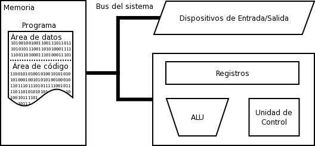

### 1.1 Programa informático

Un **programa** es un conjunto de instrucciones que se ejecutan en la CPU de manera secuencial para realizar determinadas tareas. Cada **instrucción** es un conjunto de bytes que realiza una tarea concreta.

Ejemplos de instrucciones:
- Leer un dato del teclado
- Guardar un dato en la memoria
- Ejecutar una operación sobre dos datos
- Mostrar un dato en la pantalla

Podemos clasificar los programas según su función como software de sistema, de progrmación y de aplicación.

-  El **software del sistema** se encarga de administrar el hardware e interacturar con el usuario. Debe estar instalado y configurado en nuestro ordenador para que las aplicaciones puedan ejecutarse y funcionar. El principal tipo de software de sistema es el sistema operativo. 

Algunos ejemplos de sistemas operativos son: Windows, Linux, Mac. Las funciones principales del sistema operativo son:
- Facilitar la interacción con el usuario.
- Gestionar los recursos del equipo para:
    - Facilitar al usuario el uso de los recursos o hardware del ordenador evitando que este tenga que poseer unos conocimientos profundos sobre cada uno de los dispositivos que forma el ordenador.
    - Gestionar adecuadamente los recursos del ordenador para que estos realicen bien el trabajo que se les ha encomendado.

-  El **software de programación o desarrollo** es el conjunto de herramientas que nos permiten desarrollar programas informáticos. Ejemplos editores de texto, entornos de desarrollo integrado (IDE).

- El **software de aplicación** es el conjunto de programas que tienen una finalidad más o menos concreta. Son ejemplos de aplicaciones: un procesador de textos, una hoja de cálculo, el software para reproducir música, un videojuego, etc.

    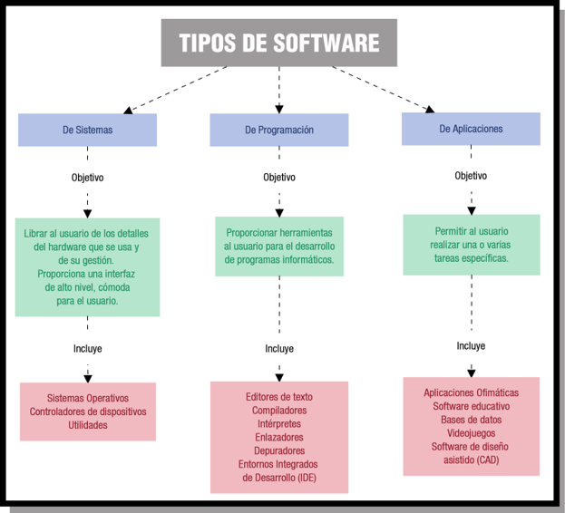

## 2. Lenguajes de programación 

Un **lenguaje de programación** es un conjunto de símbolos y reglas para combinarlos que se usan para expresar algoritmos. 

Entendemos como **algoritmo** un procedimiento preciso y no ambiguo que resuelve un problema, y un **procedimiento** como una secuencia de operaciones bien definidas, cada una de las cuales requiere una cantidad finita de memoria y se realiza en un tiempo finito.

Los lenguajes de programación, al igual que los lenguajes que usamos para comunicarnos, poseen un léxico, una sintaxis y una semántica.

Los elementos básicos de un lenguaje de programación son:

- Identificadores
- Constantes
- Operadores
- Instrucciones
- Comentarios

Los lenguajes de programación se pueden clasificar según su **cercanía al lenguaje máquina o usuario**. Lenguajes de programación según su nivel de abstracción como lenguajes de bajo, medio o alto nivel. Existen diferentes clasificaciones en este sentido pero la más extendida es la siguiente:

- **De bajo nivel**: Es el único lenguaje de programación que entiende directamente la máquina. Utiliza una secuencia de bits (0 y 1) para comunicarse con el hardware de la máquina. Es un lenguaje no interpretable por nosotros.
    
    Ejemplo: Ensamblador. Las instrucciones en ensamblador suelen tener traducción directa en lenguaje máquina. Opera directamente con los registros y direcciones de memoria. Es propio de cada procesador.


    Ejemplo de subrutina en ensamblador que realiza una cuenta de 0,5 segundos mediante la interrupción del timer.
``` armasm
 ORG	8030H
 include
 T05SEG:
	SETB TR0
	JNB uSEG,T05SEG
	CLR TR0
	CPL uSEG
	MOV R1,DPL
        INVOKE
	MOV R2,DPH
	CJNE R2,#07H,T05SEG
	CJNE R1,#78H,T05SEG
	MOV DPTR,#0
 RET
```

Ejemplo de código en lenguaje máquina y en ensamblador:


- **De medio nivel**: Permiten interactuar con el hardware hasta cierto punto. Su sintaxis es más entendible y permiten crear estructuras complejas. Se suelen usar para programar sistemas operativos.

    Ejemplo: C. Es un lenguaje que ha sido históricamente muy utilizado. Los núcleos de UNIX y Linux están programados en C.

    Ejemplo de código en lenguaje C:
```C
int power(int a, int b) {
    for (int n = 1; b > 0; --b)
        n *= a;

    return n;
}
```

- **De alto nivel**: Su alfabeto tiene palabras basadas en el lenguaje natural. Su alfabeto y su sintaxis los hacen más fácilmente entendibles y más cercanos al problema que tratan de resolver, por ello necesitan un intérprete o un compilador.
    
    Ejemplos: Basic, C++, Java, PHP, Python…

Ejemplo de código en Java que compara dos números y devuelve el resultado por pantalla:
``` Java
public class CompararNumeros {

    public static void main(String[] args) {

        int A = 25;
        int B = 10;

        if (A >= B) {
            if (A == B) {
                System.out.println("Los numeros " + A + " y " + B + " son iguales");
            } else {
                System.out.println("El número " + A + " es mayor que el número " + B);
            }
        } else {
            System.out.println("El número " + B + " es mayor que el número " + A);
        }
    }
}
```

Dentro de los lenguajes de alto nivel podemos clasificarlos según el **paradigma de programación** empleado como lenguajes estructurados y lenguajes orientados a objetos.

### 2.1 Lenguajes de programación estructurados

La **programación estructurada** es una técnica de programación que únicamente permite el uso de tres tipos de sentencias o estructuras de control:
- Sentencias secuenciales.
- Sentencias selectivas (condicionales). 
- Sentencias repetitivas (iteraciones o bucles).

Los lenguajes de programación estructurados se basan en la programación estructurada.

Ventajas de la programación estructurada:
- Los programas son fáciles de leer, sencillos y rápidos.
- El mantenimiento de los programas es sencillo.
- La estructura del programa es sencilla y clara.

Desventajas de la programación estructurada:
- Todo el programa se concentra en un único bloque (si se hace demasiado grande es difícil manejarlo).
- No permite reutilización eficaz de código, ya que todo va "en uno". Es por esto que a la programación estructurada fue sustituída por la programación modular.

### 2.2 Lenguajes de programación orientados a objetos

La **programación orientada a objetos (POO)** trata a los programas como un conjunto de objetos que colaboran entre ellos para realizar acciones, en lugar de como un conjunto ordenado de instrucciones (como sucedía en la programación estructurada).

Ventajas de la POO:
- El código es más reutilizable.
- Los errores se localizan y se depuran con facilidad.

Actividad: Clasificar lenguajes de programación estructurados y orientados a objetos

## 3. Código fuente, objeto y ejecutable

Los programas antes de ser ejecutados deben ser "traducidos" a un idioma que entienda la máquina. Por ello utilizamos programas externos asociados al lenguaje programación del programa y a la arquitectura del ordenador para majenar la "traducción" de los mismos.

Distinguimos  3 tipos de código por los que pasará el programa antes de ser ejecutado:
- **Código fuente**: conjunto de instrucciones escritas en un determinado lenguaje de programación. 
- **Código objeto**: código resultante de compilar o traducir el código fuente Puede ser código máquina o bytecode
- **Código ejecutable**: código resultante de enlazar nuestro código objeto con las librerías. Es nuestro programa ejecutable.

Dependiendo de como se realice este proceso de transformación del código hay dos tipos de traductores:

- **Compiladores**: programas que traducen código escrito en un lenguaje de programación (llamado fuente) a otro lenguaje (conocido como objeto). En este tipo de traducción el lenguaje fuente es generalmente un lenguaje de alto nivel y el objeto un lenguaje de bajo nivel.​ Este proceso se conoce como compilación.

    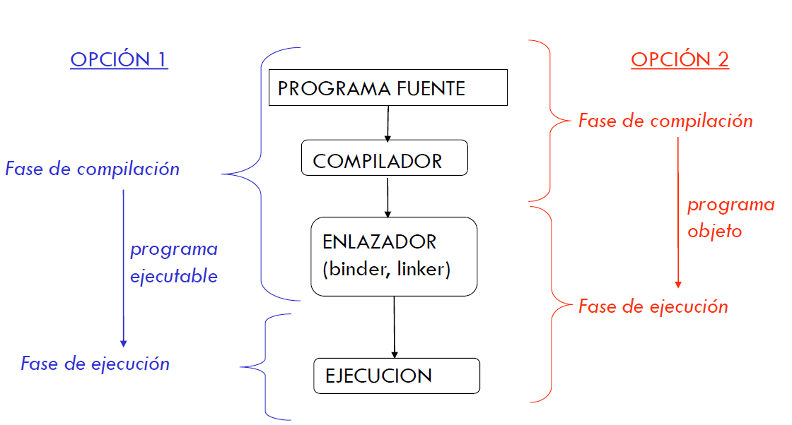

- **Intérpretes**: programas informáticos capaces de analizar y ejecutar otros programas. Los intérpretes se diferencian de los compiladores en que los intérpretes solo realizan la traducción a medida que sea necesaria (instrucción por instrucción) y normalmente no guardan el resultado de dicha traducción.

    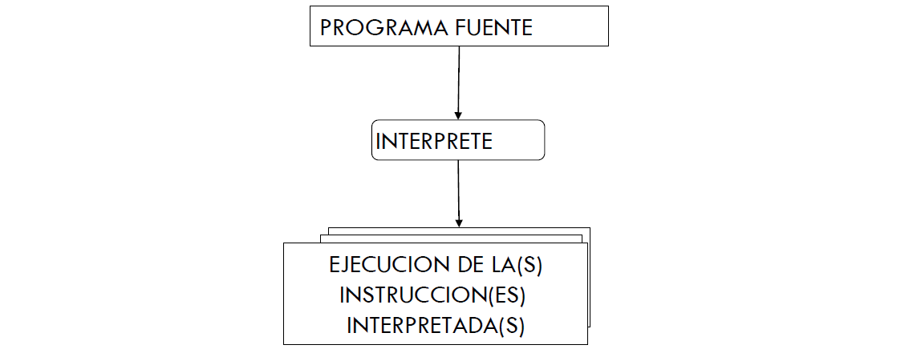

Clasificación de los lenguajes de programación según su forma de ejecución:

- Lenguajes compilados
    - Realiza el proceso de conversión de fuente a objeto.
    - Un programa enlazador unirá el código objeto con las librerías necesarias para producir el código ejecutable.
    - Luego se realizará la ejecución del mismo.
    - Ejemplos: Fortran, Familia de lenguaje C, incluyendo C++, Objective C, Ada, Pascal, Algol.

    

- Lenguajes interpretados
    - En un lenguaje interpretado, las instrucciones son traducidas y ejecutadas línea a línea. 
    - Ejemplos: Perl, PHP, Cobol, ActionScript, ASP, Bash, etc.

    

- Lenguajes virtuales
    - Funcionamiento similar a lenguajes compilados pero en vez de generar un código objeto genera un “bytecode”.
    - El bytecode puede ser interpretado por cualquier arquitectura que tenga la *máquina virtual* correspondiente.

## 4. Máquinas virtuales

Una máquina virtual es un software que simula un sistema de computación y puede ejecutar programas como si fuese una computadora real. Distinguimos dos tipos de máquinas virtuales:

- **Máquinas virtuales de sistema (System Virtual Machine)**: Emulan completamente el funcionamiento de un ordenador. Permiten tener varias máquinas completas en una sola máquina real. A nivel lógico son máquinas independientes.
- **Máquinas virtuales de proceso (Process Virtual Machine)**: Son programas que se ejecutan para interpretar las instrucciones de ciertos tipos de archivos. Cuando acaban de interpretar las instrucciones se cierran. Es el caso de la máquina virtual Java. El objetivo es que el código ejecutable sea independiente de la arquitectura.
    
    El ejemplo más conocido actualmente de este tipo de máquina virtual es la **máquina virtual de Java (Java Virtual Machine -JVM-)** que interpreta un código intermedio entre Java y código máquina.

    La JVM permite ejecutar código Java en cualquier Sistema Operativo y en cualquier arquitectura de computador (dentro de una lista de compatibilidad).

    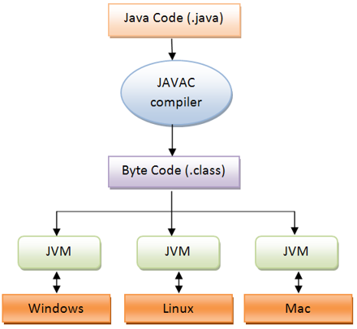

    El código (*.java) solo se compila una vez (*.class) y el desarrollador no tiene que conocer la máquina en la que se va a ejecutar.

    


    Ejemplo de desarrollo en JAVA

    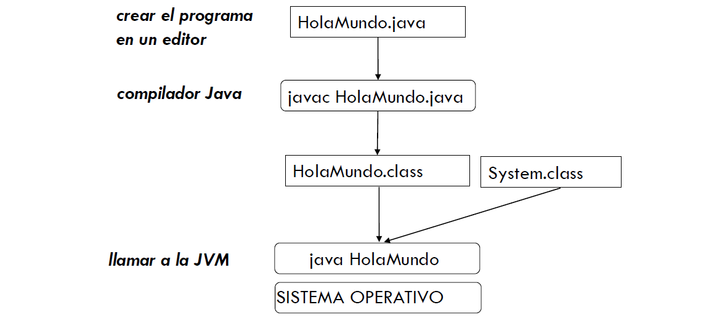

> Hacer AG1: Compilar y ejecutar códigos virtuales.

## 5. Desarrollo de software

El desarrollo de software es el proceso complejo que va desde que se concibe una idea hasta que el programa se encuentra en funcionamiento. 


Consta de una serie de pasos que conocemos como el **ciclo de vida del software**.

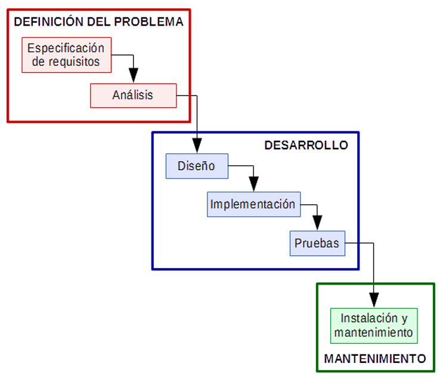


### 5.1 Análisis :mag:

En esta fase se determina **qué debe hacer el software** y depende en gran parte de la experiencia y la habilidad del analista. Tiene gran influencia en todo el desarrollo futuro del software.
 En esta fase se determinan los requisitos del proyecto, que los podemos clasificar como:
- **Funcionales**: especifica qué cosas debe poder hacer la aplicación. Posibles entradas al sistema y reacción ante todas ellas. Reacción ante situaciones peculiares.
- **No funcionales**: determinan los parámetros o características del sistema: Tiempos de respuesta, disponibilidad, tolerancia a fallos, requisitos hardware, legislación…

Todo lo que se concluye en esta fase debe quedar reflejado en un documento llamado ERS (Especificación de Requisitos del Software). Debe reflejar las especificaciones del cliente.

### 5.2 Diseño :art:

Durante esta fase, donde ya sabemos lo que hay que hacer, el siguiente paso es **¿cómo hacerlo?**

Se divide el sistema en partes y se establece relación hay entre ellas. Se decide qué hará exactamente cada parte.

Entre las principales decisiones que se toman se encuentran: las entidades y relaciones de la base de datos, el lenguaje de programación a utilizar, la selección del SGBD…

Las especificaciones del diseño se recogen en el Documento de Diseño del Software (SDD), que describe la estructura global del sistema, especifíca qué debe hacer cada uno de los módulos y cómo se combinan.

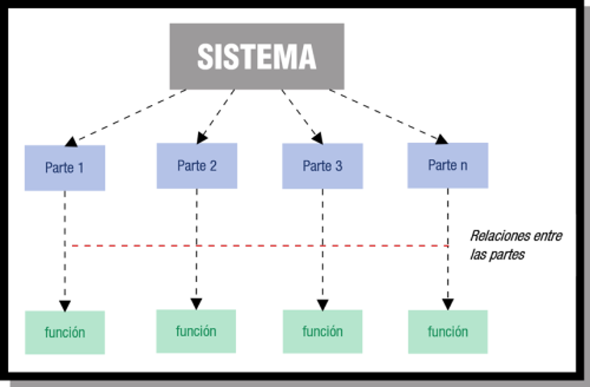

### 5.3 Codificación :computer:
En esta fase se realiza la programación, es decir, se codifican los programas.

El programador o equipo de programación debe cumplir todo lo establecido en las fases de análisis y diseño de la aplicación. Existen unas reglas de estilo que el programador debe conocer y cumplir.

Durante esta fase, el código pasa por los 3 estados visto antes:
- Código fuente
- Código objeto
- Código ejecutable

**Recuerda que en los lenguajes interpretados no se produce código objeto. El paso de fuente a ejecutable es directo*

### 5.4 Pruebas :white_check_mark:
Una vez obtenido el software, la siguiente fase del ciclo de vida son las pruebas (aunque existen metodologías en las que el diseño de las pruebas es previo a la codificación).

En esta fase se prueba el funcionamiento de los programas para detectar errores y corregirlos (depurarlos). Es un proceso imprescindible para comprobar la adecuación del software a los requisitos.

Se comienza probando cada parte por separado (pruebas unitarias) y se continúa integrando diferentes componentes (pruebas de integración). Finalmente se prueba el funcionamiento global del sistema (pruebas de validación).

Tras las pruebas se identificarán errores que deberán codificarse de nuevo. Esta corrección de errores puede suponer realizar cambios en el diseño.

### 5.5 Documentación :page_facing_up:
Esta es una fase transversal porque tiene influencia en todas las etapas. Se debe documentar adecuadamente cada una de ellas.

Además de los documentos mencionados en cada fase, se deben elaborar los siguientes documentos:
- Guía técnica (Análisis, diseño, codificación y pruebas).
- Guía de uso (Descripción, como se ejecuta, ejemplos de uso, requerimientos, solución de problemas, etc.)
- Guía de instalación (Puesta en marcha, explotación y seguridad)

### 5.6 Explotación :boom:
Una vez realizadas las pruebas y documentadas todas las fases, el siguiente paso es la explotación. Instalamos, configuramos y probamos la aplicación en los equipos del cliente.

Los usuarios finales toman contacto con la aplicación y comienzan a utilizarla.

Se lleva a cabo la BETA TEST en los equipos cliente y bajo cargas normales.

Se trata de un momento crítico del proyecto, es importante tenerlo todo preparado antes de presentarle el producto al cliente

### 5.7 Mantenimiento :wrench:
Tras la entrega del proyecto nuestro trabajo no finaliza, comienza la etapa mas larga de todo el ciclo de vida,  la fase de mantenimiento. 

Lo definimos como el proceso de control, mejora y optimización del software.

En esta fase se mantiene el contacto con el cliente para actualizar y modificar la aplicación según sus necesidades. Suelen encontrarse errores que deben corregirse y nuevos requisitos que conllevarán nuevas versiones del producto.

Se pacta con el cliente un servicio de mantenimiento de la aplicación.

## 6. Modelos del ciclo de vida del software 
Los modelos clásicos:
- Modelo en cascada
- Modelo en cascada con retroalimentación

Los modelos evolutivos:
- Modelo incremental
- Modelo en espiral

Metodologías ágiles
- Scrum

Los modelos del ciclo de vida incluyen fases similares y sólo se diferencian en la forma de presentación.

### 6.1 Modelo en cascada
Fue el primer modelo en crearse y se caracteriza por ordenar las etapas del proceso de tal forma que el inicio de cada etapa debe esperar a la finalización de la etapa anterior. Al final de cada etapa, se lleva a cabo una revisión que determina si el proyecto está listo para avanzar a la siguiente fase. 

Es sencillo y fácil de asimilar y permite no arrastrar fallos entre etapas.

No se adaptan bien a las necesidades de los proyectos ya que no suelen ser un proceso lineal y para que funcione bien los requisitos deben ser inamovibles. 

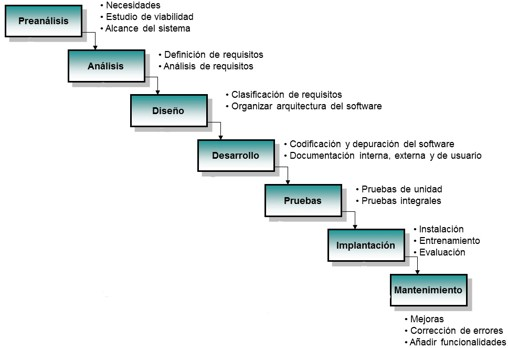

### 6.2 Modelo en cascada con retroalimentación

Es un modelo similar al anterior pero establece una retroalimentación entre las etapas que permite hacer cambios y evoluciones ddurante el proceso. 

Los cambios siguen siendo costosos ya que se realizan al terminar etapas. El cliente debe tener los requisitos claros, lo que no suele ocurrir.  

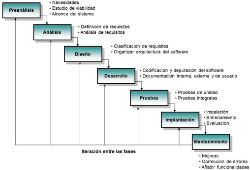

### 6.3 Modelo incremental
Es un modelo de tipo evolutivo que está basado en varios ciclos de vida en cascada aplicados repetidamente.

Este modelo emplea secuencias lineales escalonadas que proporcionan incrementos del producto en el que se añaden nuevas funcionalidades en cada uno de ellos

La principal ventaja de este modelo es que se entrega algo de valor a los clientes cada cierto tiempo  y se reduce el tiempo de desarrollo inicial

Requiere de mucha planificación, tanto administrativa como técnica y es difícil de evaluar el coste total. Además requiere de gestores experimentados.

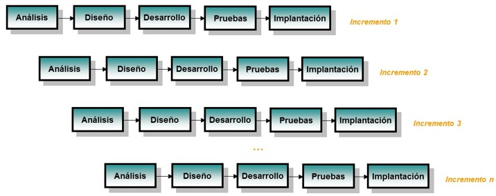

### 6.4 Modelo en espiral
Las actividades de este modelo se organizan en una espiral, en la que cada bucle o iteración representa un conjunto de actividades. Las actividades no están fijadas a ninguna prioridad, sino que las siguientes se eligen en función del análisis de riesgo, comenzando por el bucle interior.

En cada giro se construye un modelo del sistema completo. Cada entrega es más evolucionada que la anterior.

Es un buen modelo para el desarrollo de grandes sistemas.

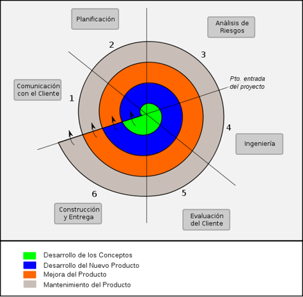

### 6.5 Metodologías ágiles. Scrum
El término de metodología ágil nace en el año 2001 como alternativa a los procesos de desarrollo de software tradicionales.

Se basan en el desarrollo iterativo e incremental y buscan satisfacer al cliente mediante entrega de productos tempranas, funcionales y continuas.

Ventajas
- Se adapta rapidamente a cambios de requisitos durante el proyecto.
- Mayor velocidad y eficiencia -> Minimiza costes.
- Se identifican errores rápidamente debido a que se van haciendo pruebas a medida que se avanza
- El equipo de desarrollo conoce el estado del proyecto en todo momento
- Mejora la calidad del producto

Algunos ejemplos de metodología ágil son eXtreme Programming (XP), Scrum, Kanban, Open Up…

#### Scrum
Es una metodología ágil para la gestión de todo tipo de proyectos.

[Introducción a Scrum... en menos de 5 minutos](https://www.youtube.com/watch?v=P25JP0u6UKw)

Los pilares de Scrum son:
- El ciclo de vida iterativo e incremental
    - Va liberando partes poco a poco y cada entrega es un incremento de funcionalidad con respecto al anterior.
    - Cada iteración se llama **sprint**: periodo de corta duración, menor de 4 semanas, que finaliza con un prototipo operativo o producto potencialmente entregable.
    - Lo que se implementa en cada sprint proviene de la **pila del producto (Product Backlog)** que contiene un conjunto de ítems.
    - Una figura clave es el **propietario del producto (Product Owner)**: responsable de gestionar, mantener y priorizar el Product Backlog.
    - Otra figura importante es el **Scrum Master**: una sola persona que ayuda al equipo y al Product Owner a finalizar con éxito, evitando incidentes, resovliendo cuellos de botella, etc. y haciendo que se cumpla el método Scrum
    - Una vez seleccionado el ítem o ítems a desarrollar en el sprint el equipo los divide en la **pila del sprint (Sprint Backlog)**, que será inamovible durante el sprint.
- Reuniones a lo largo del proyecto
    - Se logra transparencia y comunicación y hacen que el equipo sea auto-gestionado y multifuncional
    - **Reunión de Planificación del Sprint (Sprint Planning Meeting)**: al principio de cada Sprint, para decidir que se va a realizar en ese Sprint.
    - **Reunión diaria (Daily Scrum)**: máximo 15 minutos, en la que se trata qué hizo ayer, qué va a hacer hoy y qué problemas se han encontrado.
    - **Reunión de Revisión del Sprint (Sprint Review Meeting)**: al final de cada Sprint, y se trata qué ha completado y qué no. También se muestra el trabajo al Product Owner.
    - **Retrospectiva del Sprint (Sprint Retrospective)**: también al final del Sprint, y sirve para que los implicados den sus impresiones sobre el Sprint, y se utiliza para la mejora del proceso.

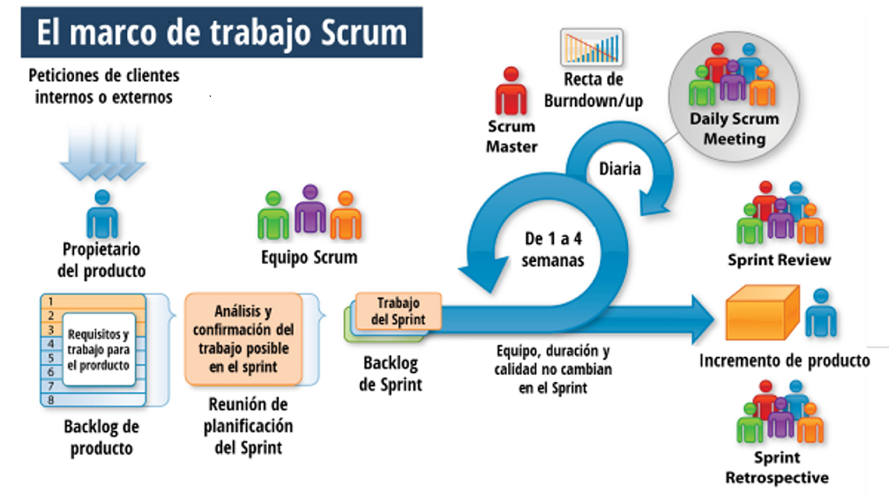
